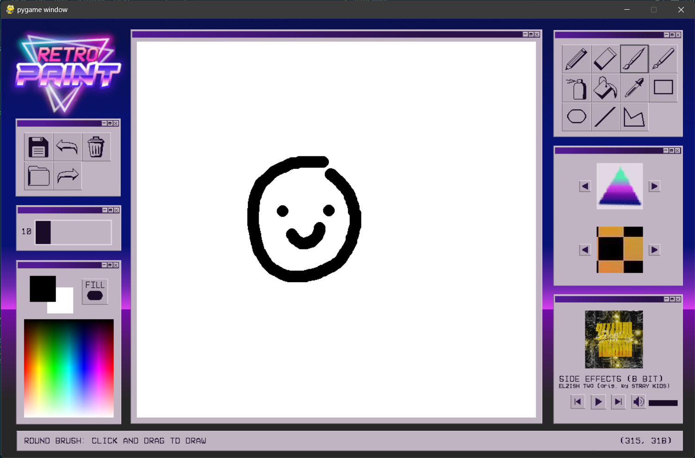
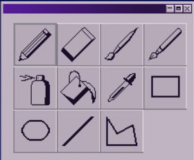
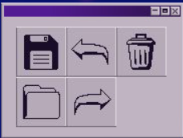
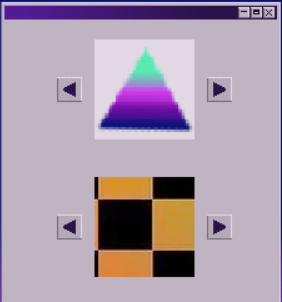
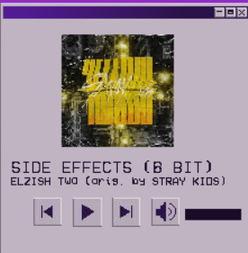
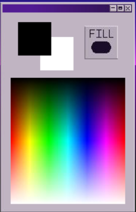
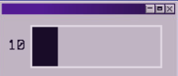
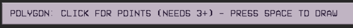

# Retro Paint

[About](#about) ◈ [Installation](#installation) ◈ [How to use](#how-to-use) ◈ [Features](#features)

## About

> [!NOTE]  
> This project was made for a school assignment. It is no longer maintained.

Retro Paint is a synthwave-themed doodling app. 

## Installation

### Windows

1. Create a virtual environment

    `python -m venv <name of environment>`

2. Download source code as a .zip
3. Unzip it into the folder with virtual environment
4. Install required packages from *requirements.txt*

    `pip install -r requirements.txt`

## How to use

1. Run *main.py*
2. See below for all features and how to use

## Features

- **Painting tools**
  
  

  - Click and drag to use
  
  1. Pencil
  2. Eraser
  3. Paintbrush (round)
  4. Calligraphy brush (rectangle)
  5. Spray paint
  6. Fill bucket
  7. Eyedropper
  8. Shapes (toggle filled and unfilled)
      - Rectangle
      - Ellipse
      - Line
      - Polygon (click for points; press space to draw)

- **Other tools**

  

  1. Save to file
  2. Undo
  3. Clear canvas (fill canvas with background colour or backdrop)
  4. Import image (.png or .jpg) as background
  5. Redo

- **6 stamps & 6 backgrounds**

  

  - Use the arrows to browse
  - For stamps: click on the preview image to select and click on the canvas to apply
  - For backgrounds: use the fill bucket to apply

- **Music**

  

  - 8-bit Stray Kids songs
  - Use arrows to switch songs and the play/pause button to control playback
  - Press the speaker button to toggle mute/unmute or use the slider to control volume

- **Misc**

  

  1. Choose foreground/background colour
      - Left square is foreground and right square is background. Whichever one is on top is the one that is being changed. 
      - Click on the square to bring it to the top and click anywhere on the colour selector to change the colour.
  2. Fill button to toggle whether shapes are filled
  
  

  3. Change size of paint tools except pencil

  

  4. Information bar at the bottom with hint on how to use the tools
